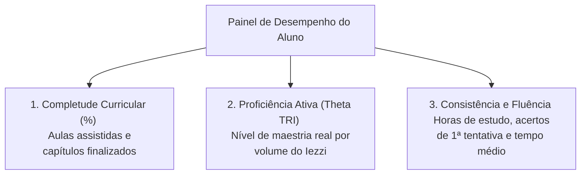
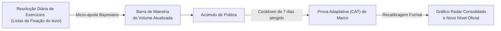
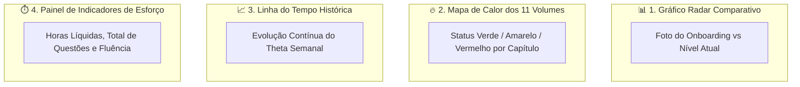

<!-- ai-summary
Módulo Progresso / Desempenho. Sistema de mensuração tridimensional e acompanhamento da evolução do aluno na coleção Iezzi.
3 dimensões de métricas:
1. Completude Curricular (% de aulas e listas dos 11 volumes concluídas).
2. Proficiência Ativa (Theta TRI por volume e área, atualizado continuamente).
3. Consistência e Fluência (Horas de estudo, taxa de acerto na 1ª tentativa e velocidade média).
Atualização contínua híbrida: micro-ajustes bayesianos no dia a dia + marcos oficiais na Prova CAT a cada 7 dias.
Visualizações gráficas centrais:
- Gráfico Radar Comparativo (Antes no Onboarding vs Atual).
- Mapa de Calor dos 11 Volumes (Heatmap de Domínio por capítulo).
- Gráfico de Linha de Evolução Histórica (Theta temporal).
- Painel de Indicadores de Esforço e Dedicação.
Recomendações automáticas dos 3 tópicos com menor taxa de acerto.
Exportação de Boletim/Relatório de Desempenho em PDF para o aluno.
-->

# Progresso / Desempenho

Documentação do sistema de mensuração de aprendizagem, análise contínua de proficiência (**TRI**), visualizações gráficas de domínio e emissão de relatórios de desempenho do **Tutor Inteligente**.

---

## 1. Modelo de Métricas Tridimensionais

O progresso do estudante é estruturado em três dimensões complementares para diferenciar esforço de domínio real:

| Dimensão | O que mede | Fonte dos dados | Unidade |
|:---|:---|:---|:---|
| **Completude Curricular** | Cobertura dos tópicos dos 11 volumes | Aulas concluídas e listas de fixação | Percentual (0% a 100%) |
| **Proficiência Ativa ($\theta$)** | Grau de habilidade matemática | Testes adaptativos (CAT) e exercícios | Escala TRI ($-3.0$ a $+3.0$) e Níveis |
| **Consistência & Fluência** | Ritmo de aprendizagem e retenção | Cronômetro de estudo e histórico de tentativas | Horas líquidas e segundos/questão |

---

## 2. Dinâmica de Atualização de Proficiência ($\theta$)

A proficiência do estudante não é estática, operando em modelo híbrido:

---

## 3. Visualizações Gráficas Principais

A tela de Progresso apresenta 4 visões integradas de alto impacto:

---

## 4. Recomendações Diretas e Exportação

1. **Recomendações por Menor Desempenho**: Apresenta em destaque os **3 tópicos com menor taxa de acerto**, com botão direto para refazer a bateria de exercícios e revisar a aula correspondente.
2. **Boletim em PDF do Estudante**: Geração com 1 clique de relatório consolidado em PDF para arquivamento ou comprovação de horas complementares.

---

## 5. Navegação nas Seções Detalhadas

| Seção | Descrição |
|:---|:---|
| [Fluxo](flow/index.md) | Ciclo de dados, micro-calibragem de $\theta$, geração do heatmap e exportação de relatórios |
| [Regras de Negócio](business-rules/index.md) | Especificação das regras RN-PRG-001 a RN-PRG-020 (fórmulas, pesos, thresholds de cores e PDFs) |
