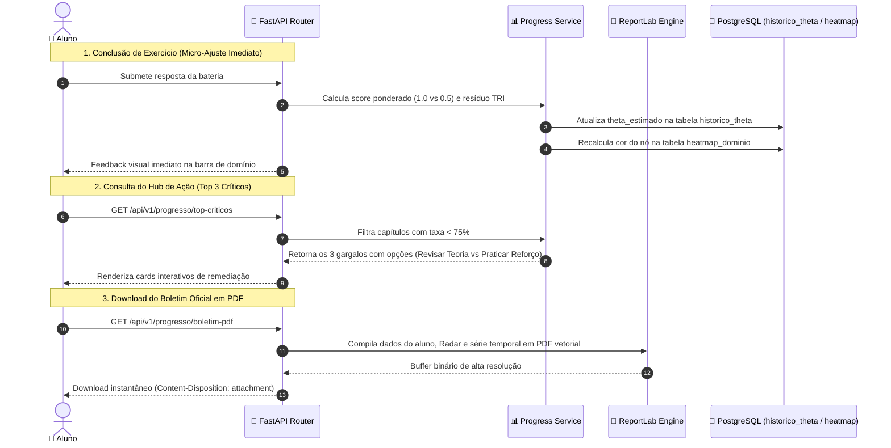

<!-- ai-summary
Hub de protótipos de código do módulo de Progresso / Desempenho.
Implementações técnicas de referência em Python 3.11 (FastAPI, NumPy/SciPy, ReportLab) e TypeScript:
1. Schemas e DTOs de Métricas Tridimensionais e Heatmap (Pydantic v2).
2. Algoritmo de Micro-Ajuste Bayesiano de Theta e Taxa Ponderada de Acertos.
3. Agregador do Heatmap de Domínio e Detector dos Top 3 Tópicos Críticos com Hub de Ação.
4. Emissor de Boletim Oficial em PDF de Alta Resolução com ReportLab.
5. Endpoints REST da API FastAPI.
-->

# Progresso — Protótipos de Código e Analytics

Esta seção reúne as implementações de referência e o código-fonte executável do subsistema de **analytics pedagógico**, **calibragem bayesiana contínua da TRI ($\theta$)**, consolidação do **Heatmap de Domínio dos 11 Volumes** e emissão de **boletins escolares em PDF vetorial** da plataforma **Tutor Inteligente**.

---

## Estrutura dos Protótipos Técnicos

| Documento | Escopo Técnico | Linguagem / Stack |
|:---|:---|:---:|
| [1. Schemas & DTOs](schemas.md) | Contratos tipados de progresso geral, nós do heatmap, dados do radar e tipos TypeScript | **Pydantic v2 / TypeScript** |
| [2. Calibragem Contínua de Theta](theta-updater.md) | Algoritmo de micro-ajuste estocástico do $\theta$ a cada item respondido e pontuação ponderada | **Python / NumPy / SciPy** |
| [3. Agregador Heatmap & Top 3](heatmap-service.md) | Mapeamento dos 4 estados de cores, completude e Hub de Ação nos 3 tópicos mais frágeis | **Python / SQLAlchemy** |
| [4. Gerador de Boletim em PDF](pdf-generator.md) | Emissão em sub-100ms de relatório oficial com ReportLab sem dependências pesadas de SO | **Python / ReportLab** |
| [5. Endpoints da API FastAPI](endpoints.md) | Rotas assíncronas para consumo de dashboards, séries temporais e download do PDF | **FastAPI / Python** |

---

## Circuito Fechado de Métricas e Feedback Contínuo

