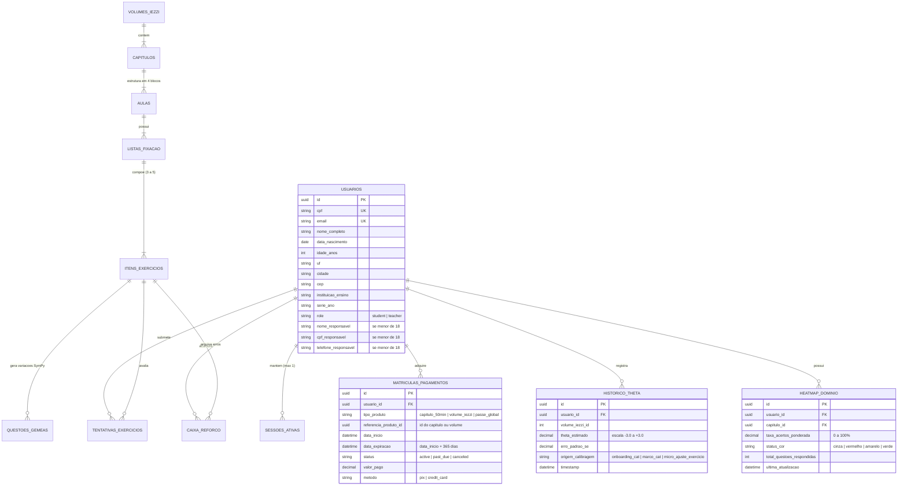
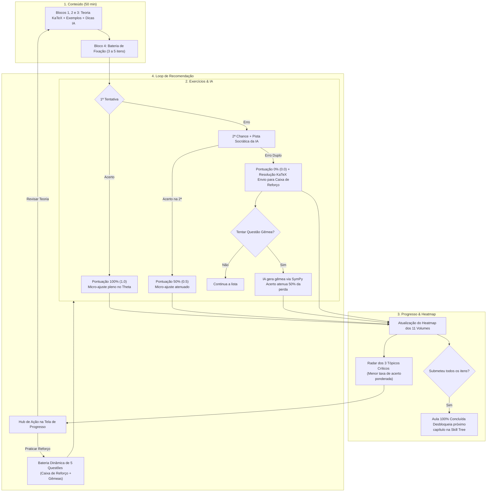
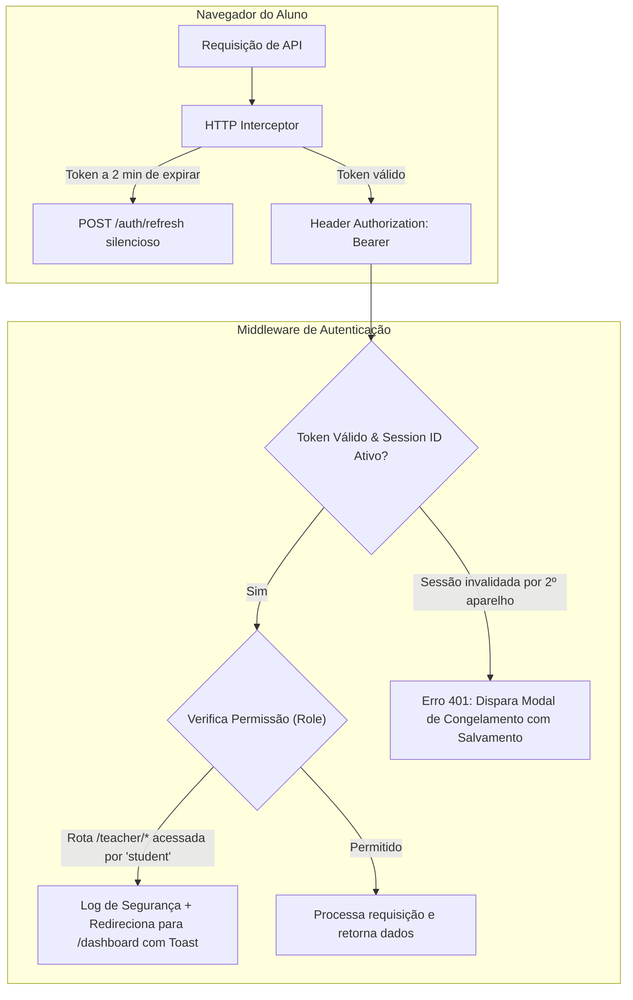

<!-- ai-summary
Arquitetura de dados, modelagem relacional e fluxo de integração inter-módulos da plataforma Tutor Inteligente.
Detalhamento do ciclo fechado da Tríade Pedagógica: Conteúdo (11 Volumes Iezzi) <-> Exercícios (CAT & Questões Gêmeas) <-> Progresso (TRI, Heatmap e Recomendações).
Diagrama de Entidade-Relacionamento (ERD) e ciclo de vida dos dados desde o Onboarding até a consolidação no Painel do Professor.
-->

# Arquitetura de Dados e Integração Inter-Módulos

Documentação técnica do fluxo de dados e relacionamentos entre os 8 módulos da plataforma **Tutor Inteligente**, com foco especial na integração da **Tríade Pedagógica**:

$$\text{Conteúdo (Iezzi \& 11 IAs)} \longleftrightarrow \text{Exercícios (CAT \& Questões Gêmeas)} \longleftrightarrow \text{Progresso (TRI } \theta \text{, Heatmap \& Recomendações)}$$

---

## 1. Diagrama de Entidade-Relacionamento (ERD)

A base de dados centraliza as informações cadastrais do **Onboarding**, os contratos comerciais de **Pagamento** e a trilha de aprendizagem contínua:

---

## 2. O Ciclo Fechado da Tríade Pedagógica

A aprendizagem do estudante opera em circuito fechado (*closed-loop learning*):

---

## 3. Regras Matemáticas de Integração Inter-Módulos

### 3.1 Ponderação da Taxa de Acertos do Capítulo
Para cada questão da bateria de fixação:

$$\text{Score}(q) = \begin{cases} 
1.0, & \text{se acertada na 1ª tentativa} \\ 
0.5, & \text{se acertada na 2ª tentativa (com auxílio de dica)} \\ 
0.0, & \text{se errada nas 2 tentativas} 
\end{cases}$$

A taxa ponderada de maestria do capítulo no Heatmap é dada por:

$$\text{Taxa Ponderada} (\%) = \left( \frac{\sum_{q=1}^{N} \text{Score}(q)}{N} \right) \times 100$$

### 3.2 Thresholds de Cores do Heatmap
- **Cinza (Neutro)**: $N < 3$ questões respondidas no capítulo.
- **Vermelho (Crítico)**: $N \ge 3$ e $\text{Taxa Ponderada} < 50\%$.
- **Amarelo (Em Desenvolvimento)**: $N \ge 3$ e $50\% \le \text{Taxa Ponderada} < 75\%$.
- **Verde (Consolidado)**: $N \ge 3$ e $\text{Taxa Ponderada} \ge 75\%$.

---

## 4. Integração com o Painel do Professor

Todos os eventos gerados pela Tríade Pedagógica são consumidos pelo **Painel do Professor**:
- **Filtro Demográfico**: Cruza a Taxa Ponderada com a Rede de Ensino (Pública vs Privada) e Região/UF do Onboarding.
- **Dossiê Individual**: O professor abre a Ficha do Aluno e inspeciona em quais capítulos o estudante solicitou mais Questões Gêmeas e quais estão arquivados na Caixa de Reforço.
- **Intervenção Docente**: O professor pode emitir uma lista extra de reforço com 1 clique diretamente para o aluno com dificuldades.

---

## 5. Arquitetura de Sessões, Segurança e Roteamento

A segurança de acesso e a proteção de rotas operam com validação distribuída em camadas:

