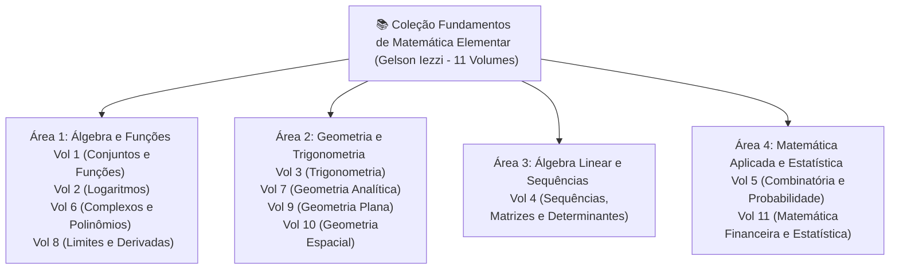
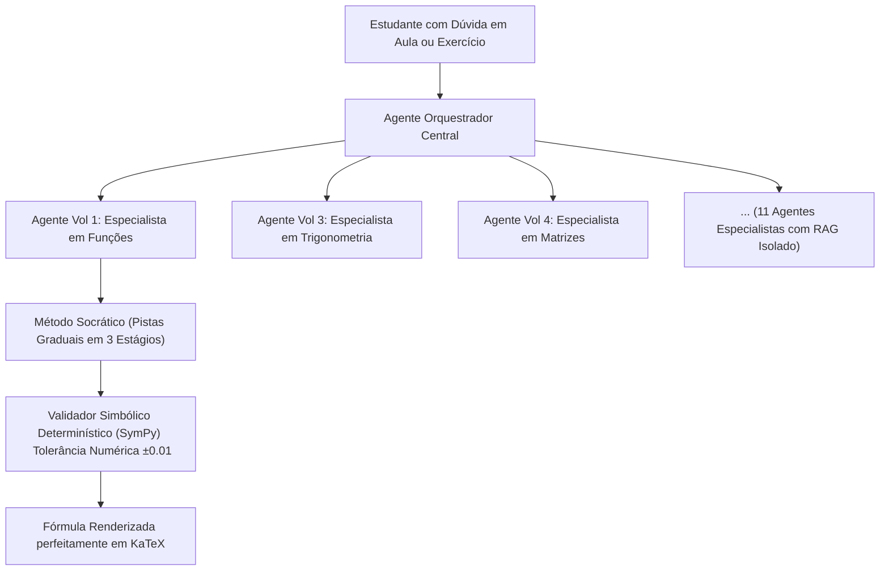
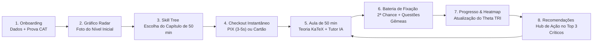

<!-- ai-summary
Visão completa do produto Tutor Inteligente. Tese pedagógica e de negócio, público-alvo, bibliografia da coleção Gelson Iezzi (11 volumes), modelo de monetização por capítulos de 50 minutos e arquitetura de inteligência artificial socrática.
-->

# Contexto do Projeto e Tese do Produto

O **Tutor Inteligente** é uma plataforma EAD de alta performance educacional focada no ensino de **Matemática do 2º Grau (Ensino Médio)**, idealizada para o ecossistema de um professor e estruturada para transformar o aprendizado matemático em uma experiência personalizada, adaptativa e orientada a resultados concretos.

---

## 1. A Tese Pedagógica e o Problema Resolvido

### 1.1 O Desafio do Estudante de Ensino Médio
A Matemática do Ensino Médio apresenta um dos maiores índices de retenção e ansiedade escolar no Brasil. Os estudantes enfrentam duas dores críticas:
1. **Socorro Imediato para Provas Escolares**: O aluno tem uma prova bimestral na escola amanhã ou depois e precisa dominar com urgência um tópico específico (ex: *Função Quadrática* ou *Razões Trigonométricas*).
2. **Lacunas Cumulativas de Aprendizagem**: Erros em conteúdos básicos (como fatoração ou produtos notáveis) inviabilizam o progresso em álgebra avançada, geometria e cálculo.

### 1.2 A Solução: Sessões de 50 Minutos e Trilha Flexível
Para solucionar essas dores com precisão:
- Cada capítulo temático é dimensionado exatamente para **uma sessão de aprendizagem de 50 minutos (1 hora-aula)** em 4 blocos (Conceito KaTeX, Exemplos Passo a Passo, Dicas do Tutor IA e Fixação).
- **Acesso Direto sem Travamento**: O estudante pode navegar diretamente para o capítulo que precisa estudar hoje para a prova da escola, sem ser obrigado a cumprir toda a trilha linear desde o início, recebendo alertas amigáveis de pré-requisitos quando aplicável.

---

## 2. A Base Bibliográfica: Coleção Gelson Iezzi

Todo o arcabouço curricular, rigor formal, teoremas, demonstrações e exercícios derivam integralmente da obra canônica **Fundamentos de Matemática Elementar** (Gelson Iezzi e coautores - 11 volumes), organizada em 4 Grandes Áreas:

---

## 3. Arquitetura de Inteligência Artificial: Os 11 Agentes Especialistas

A plataforma rejeita a abordagem de "chatbots genéricos" que cometem alucinações algébricas. Em vez disso, opera com uma rede multi-agente especializada:

---

## 4. O Modelo de Negócio e Precificação

A plataforma é **100% comercial e automatizada**, sem degustação aberta após o diagnóstico inicial e sem liberação manual de cortesias:

| Modalidade | Formato Pedagógico | Proposta de Valor | Modelo de Cobrança | Vigência de Acesso |
|:---|:---|:---|:---|:---:|
| **Capítulo Avulso** | 1 sessão de 50 minutos (4 blocos) | Socorro focado para a matéria da prova escolar | Micro-compra avulsa | **12 Meses (365 dias)** |
| **Volume do Iezzi** | Livro completo + Agente IA do volume | Domínio integral da disciplina com desconto | Abatimento integral de capítulos já pagos | **12 Meses (365 dias)** |
| **Passe Global** | 11 volumes + 11 IAs + CATs ilimitados | Preparação completa para o 2º Grau e Vestibulares | Assinatura Mensal / Anual | Recorrência ativa |

---

## 5. A Jornada Completa do Estudante em Circuito Fechado

---

## 6. O Papel do Painel do Professor

O professor atua como regente pedagógico e gestor comercial da sua escola digital:
- **Demografia e Analytics**: Cruzamento de médias de proficiência ($\bar{\theta}$) por Estado, Município, Idade e Tipo de Escola (Pública vs Privada).
- **Curadoria e Qualidade**: Workflow *Draft & Publish* com editor split-screen KaTeX para revisar aulas e baterias de Questões Gêmeas propostas pelas IAs.
- **Ficha do Aluno**: Acompanhamento do radar individual, atribuição de listas de reforço e liberação manual de reteste do CAT.
- **Auditoria Financeira**: Monitoramento de vendas por produto (Capítulos vs Volumes vs Assinaturas) sem interferência manual de bolsas.
