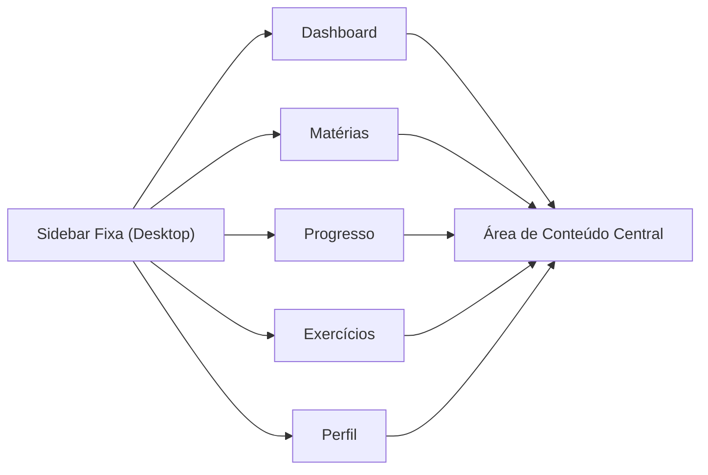
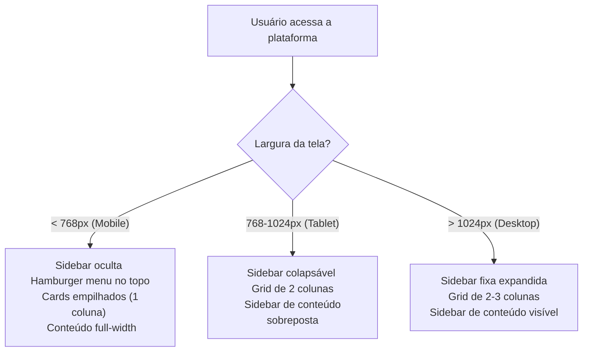
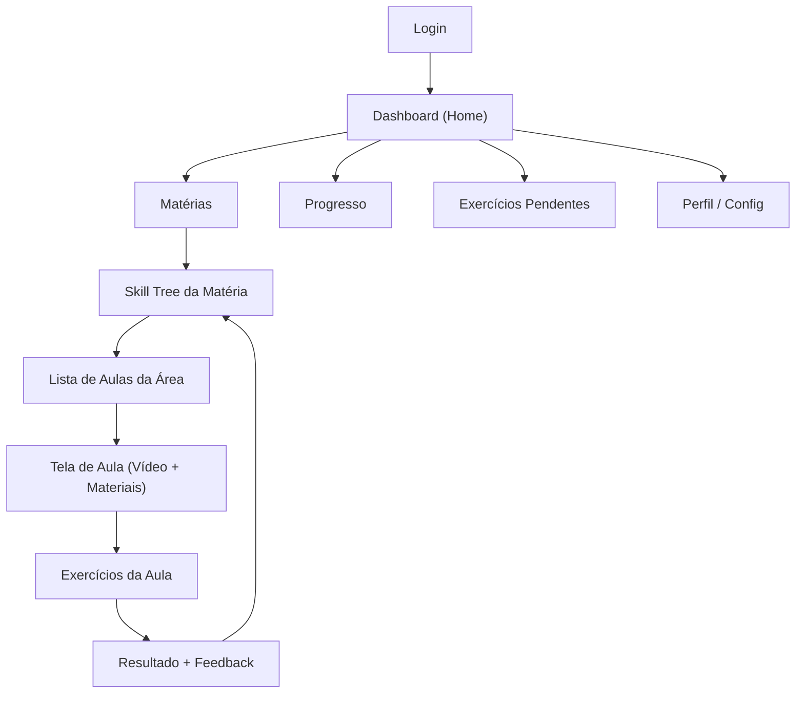
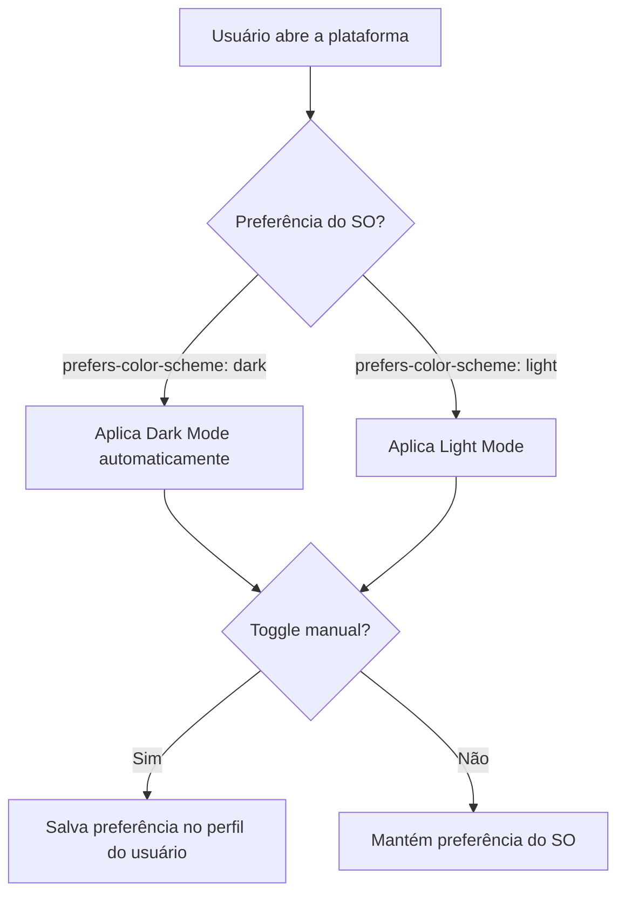

# 1. Navegação e Layout

### 1.1 Estrutura Geral da Interface

A plataforma segue o padrão **sidebar fixa + área de conteúdo**, com comportamento adaptativo por dispositivo.

### 1.2 Comportamento Responsivo por Breakpoint

### 1.3 Transição entre Telas

### 1.4 Dark Mode

