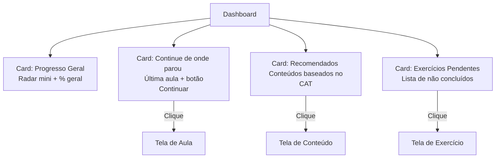
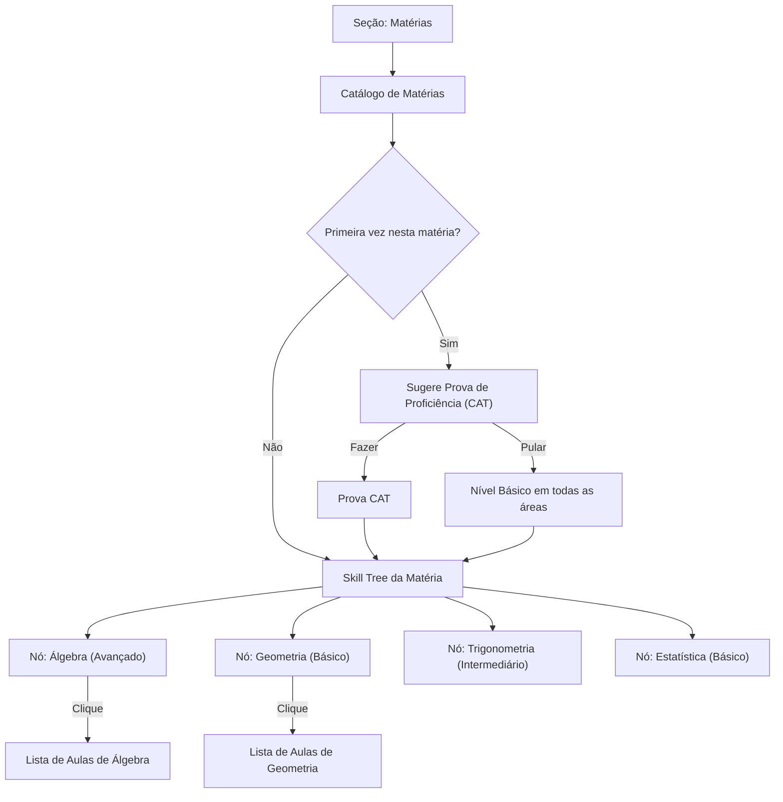
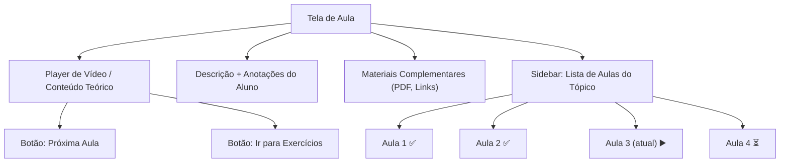
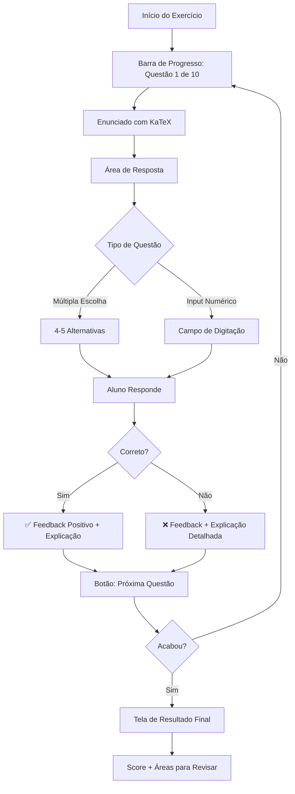
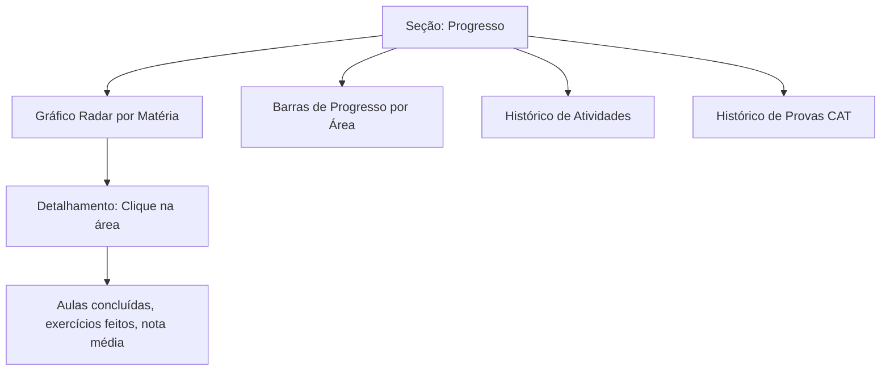
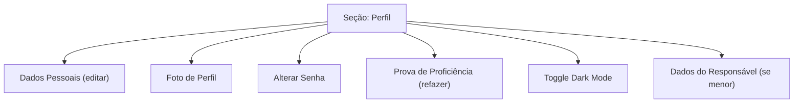

# 2. Telas do Aluno

### 2.1 Dashboard (Home)

Primeira tela após o login. Grid de cards modulares com resumo do progresso e ações rápidas.

---

### 2.2 Matérias e Skill Tree

O aluno navega pelo catálogo de matérias e visualiza a árvore de habilidades.

---

### 2.3 Tela de Aula / Conteúdo

Tela de consumo de conteúdo com vídeo, materiais e navegação entre aulas.

---

### 2.4 Tela de Exercícios

Tela dedicada e focada (sem sidebar), uma questão por vez com feedback imediato.

---

### 2.5 Progresso Consolidado

Visão geral do progresso do aluno por matéria e área.

---

### 2.6 Perfil e Configurações

