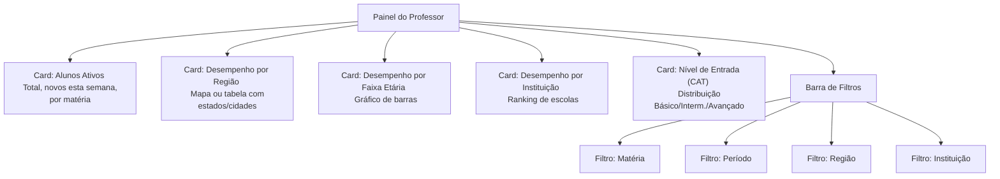
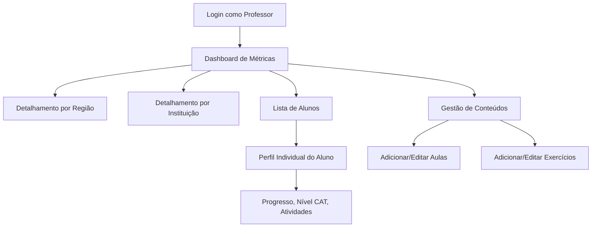

# 3. Telas do Professor

### 3.1 Painel do Professor — Dashboard de Métricas

O professor acessa um dashboard dedicado com cards de métricas, gráficos e filtros avançados.

### 3.2 Navegação do Professor

