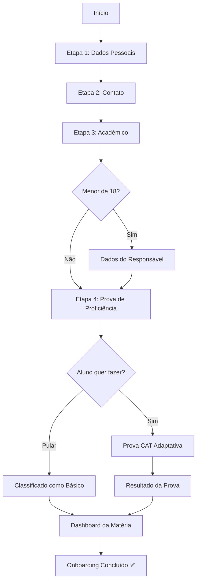
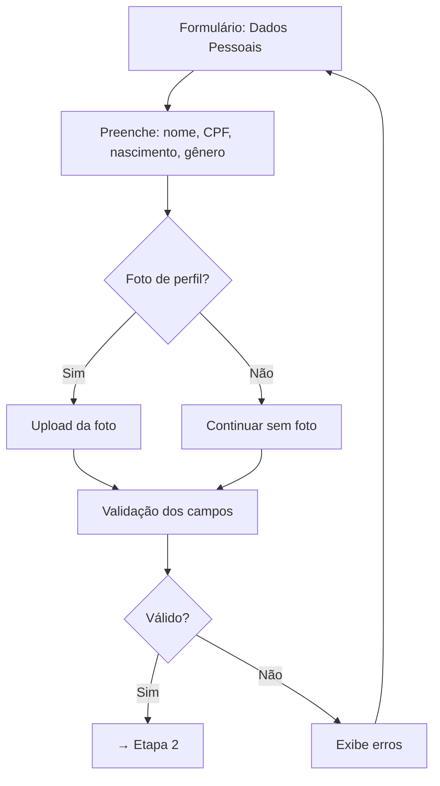
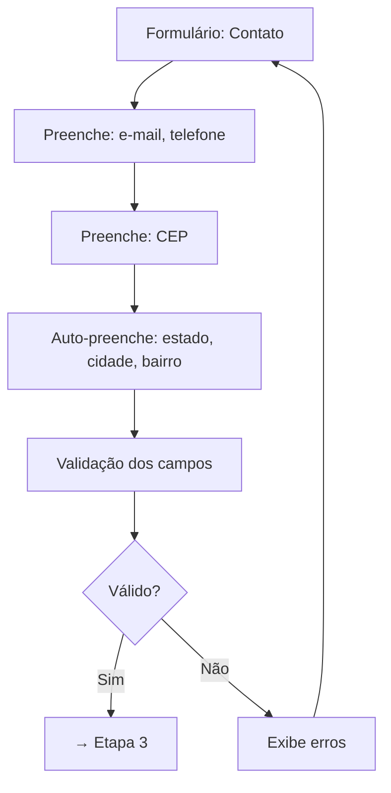
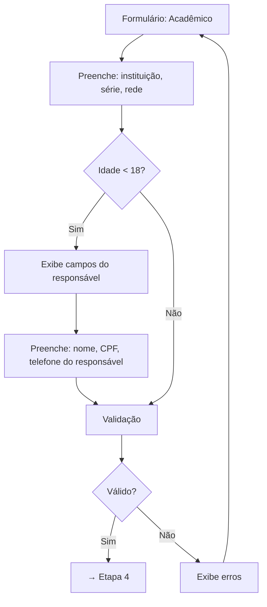
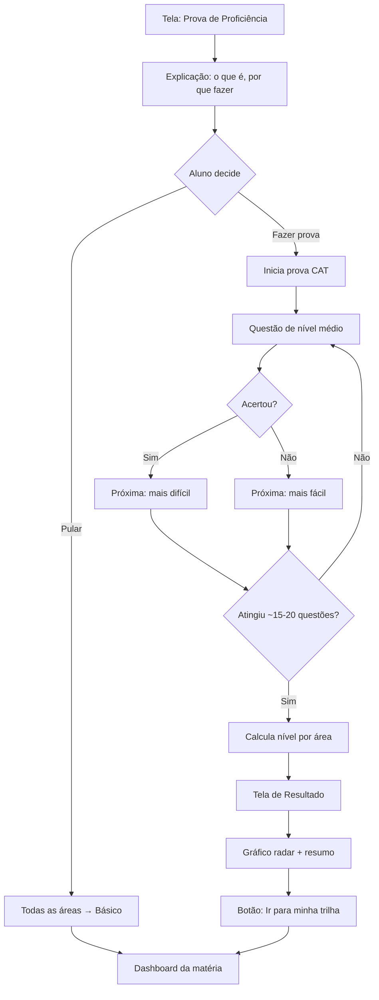
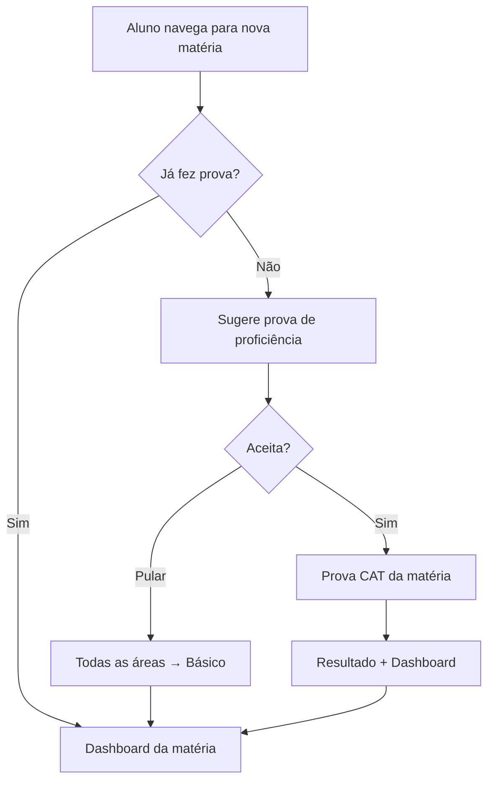
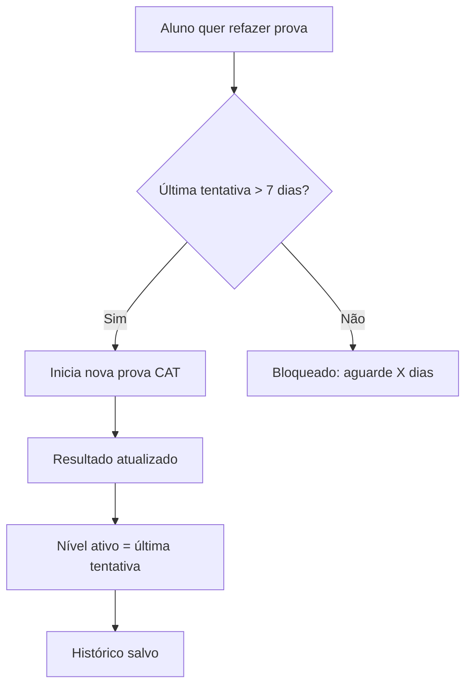

<!-- ai-summary
Fluxo do módulo Onboarding. Wizard de 4 etapas: Dados Pessoais → Contato → Acadêmico → Prova de Proficiência.
Cadastro com validação por etapa. Dados do responsável condicionais (menor de 18). Prova CAT adaptativa ao entrar na matéria.
Pós-prova: resultado visual (gráfico radar) → dashboard da matéria com trilha personalizada.
-->

# Onboarding — Fluxo

## Fluxo Geral

## Etapa 1: Dados Pessoais

## Etapa 2: Contato

## Etapa 3: Acadêmico

## Etapa 4: Prova de Proficiência

## Fluxo de Prova para Novas Matérias (futuro)

## Fluxo de Refazer Prova

