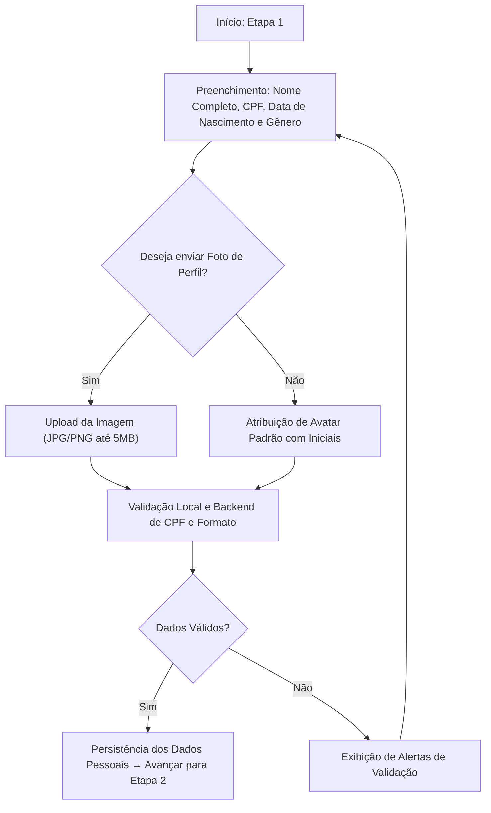
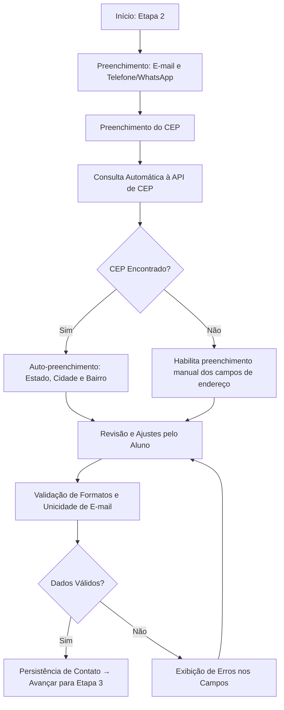
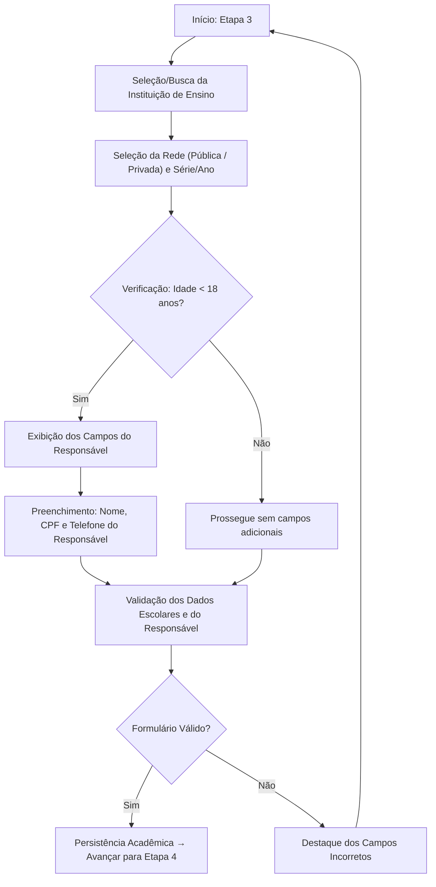

# 2. Fluxo do Wizard de Cadastro

### 2.1 Etapa 1: Dados Pessoais
Nesta etapa, coletam-se os dados de identificação civil do aluno. A data de nascimento alimenta a lógica de checagem de maioridade para as etapas seguintes.

---

### 2.2 Etapa 2: Contato e Endereço
Coleta as informações de comunicação e localização geográfica do aluno, aproveitando o CEP para preenchimento ágil.

---

### 2.3 Etapa 3: Dados Acadêmicos e Menoridade
Coleta os dados escolares e insere dinamicamente os campos de responsável legal se o cálculo da idade for inferior a 18 anos.

