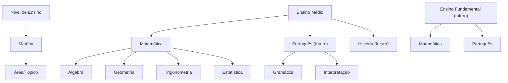

<!-- ai-summary
Módulo Onboarding. Cadastro do aluno em wizard de 4 etapas: (1) Dados pessoais, (2) Contato, (3) Acadêmico, (4) Prova de proficiência.
Campos: nome completo, data de nascimento, CPF, e-mail, telefone/WhatsApp, gênero, endereço completo (CEP, estado, cidade, bairro), instituição de ensino, série/ano, foto de perfil, dados do responsável (obrigatório se menor de 18).
Prova de proficiência adaptativa (CAT) ao entrar numa matéria pela primeira vez. Pode pular (classificado como Básico). Pode refazer com cooldown de 7 dias.
3 níveis: Básico, Intermediário, Avançado — calculados por área/tópico dentro de cada matéria.
Modelo hierárquico escalável: Nível de Ensino → Matéria → Área/Tópico.
Tipos de questão: multiple_choice, numeric_input, text_input (futuro).
Resultado visual: gráfico radar + resumo textual + botão para trilha personalizada.
Pós-prova: direcionado ao dashboard da matéria com trilha personalizada.
Sem inserção de boletins/notas.
-->

# Onboarding

Primeiro contato do aluno com a plataforma — cadastro em etapas (wizard), prova de proficiência adaptativa e direcionamento para trilha personalizada.

## Visão Geral

O onboarding é um **wizard de 4 etapas** que guia o aluno desde o cadastro até o início dos estudos:

| Etapa | Nome | Descrição |
|-------|------|-----------|
| 1 | Dados Pessoais | Nome, CPF, nascimento, gênero, foto |
| 2 | Contato | E-mail, telefone, endereço completo |
| 3 | Acadêmico | Instituição de ensino, série/ano, dados do responsável (se menor) |
| 4 | Prova de Proficiência | Prova adaptativa (CAT) para classificar o aluno por área |

## Campos de Cadastro

### Dados Pessoais (Etapa 1)

| Campo | Tipo | Obrigatório | Observação |
|-------|------|-------------|------------|
| Nome completo | texto | ✅ | |
| Data de nascimento | data | ✅ | Usado para calcular idade e exigir responsável |
| CPF | texto (validado) | ✅ | Identificação única, certificados, pagamento |
| Gênero | select | ✅ | Métricas demográficas no Painel do Professor |
| Foto de perfil | upload imagem | ❌ | Personalização do perfil |

### Contato (Etapa 2)

| Campo | Tipo | Obrigatório | Observação |
|-------|------|-------------|------------|
| E-mail | e-mail | ✅ | Login e comunicação |
| Telefone/WhatsApp | telefone | ✅ | Comunicação e recuperação de conta |
| CEP | texto | ✅ | Auto-preenche estado, cidade, bairro |
| Estado | select | ✅ | Métrica por região |
| Cidade | texto | ✅ | Métrica por região |
| Bairro | texto | ✅ | Métrica por região |

### Acadêmico (Etapa 3)

| Campo | Tipo | Obrigatório | Observação |
|-------|------|-------------|------------|
| Instituição de ensino | texto/autocomplete | ✅ | Métrica por instituição |
| Série/ano atual | select | ✅ | Adaptável para outros níveis de ensino |
| Rede de ensino | select (pública/privada) | ✅ | Métrica adicional |

### Responsável (Etapa 3 — condicional)

> Exibido **somente se o aluno tiver menos de 18 anos** (calculado pela data de nascimento).

| Campo | Tipo | Obrigatório | Observação |
|-------|------|-------------|------------|
| Nome do responsável | texto | ✅ (se menor) | |
| CPF do responsável | texto (validado) | ✅ (se menor) | |
| Telefone do responsável | telefone | ✅ (se menor) | |

## Prova de Proficiência (Etapa 4)

### Modelo: Computerized Adaptive Testing (CAT)

A prova utiliza o modelo **CAT** (teste adaptativo computadorizado):

- Começa com questões de **nível médio**
- Acertou → próxima questão **mais difícil**
- Errou → próxima questão **mais fácil**
- Calcula o nível com **~15-20 questões** por matéria
- Mais preciso e mais rápido que provas fixas

### Gatilho da Prova

A prova é acionada **ao entrar numa matéria pela primeira vez**:

- No onboarding (como só existe Matemática), o aluno é direcionado automaticamente
- Quando novas matérias forem adicionadas, a prova aparece ao clicar na matéria pela primeira vez
- O aluno **pode pular** → classificado como **Básico** em todas as áreas

### Níveis de Proficiência

| Nível | Código | Descrição |
|-------|--------|-----------|
| Básico | `basic` | Pouco ou nenhum domínio da área |
| Intermediário | `intermediate` | Domínio parcial, precisa reforçar |
| Avançado | `advanced` | Bom domínio da área |

O nível é calculado **por área/tópico** dentro de cada matéria:

```
Matemática (Ensino Médio):
├── Álgebra: Avançado
├── Geometria: Básico
├── Trigonometria: Intermediário
└── Estatística: Básico
```

### Tipos de Questão

| Tipo | Código | Uso | Matérias |
|------|--------|-----|----------|
| Múltipla escolha | `multiple_choice` | 4-5 alternativas | Todas |
| Resposta numérica | `numeric_input` | Aluno digita o resultado | Exatas (Matemática, Física...) |
| Resposta textual | `text_input` | Futuro — resposta aberta | Humanas (Português, História...) |

### Política de Refazer

- O aluno **pode refazer** a prova a qualquer momento
- **Cooldown de 7 dias** entre tentativas
- Histórico de todas as tentativas é salvo
- O nível ativo é sempre o da **última tentativa**

### Resultado da Prova

Após completar, o aluno vê:

1. **Gráfico radar** com o nível por área
2. **Resumo textual**: "Você tem domínio forte em Álgebra e pode focar mais em Geometria"
3. **Botão**: "Ir para minha trilha personalizada" → leva ao dashboard da matéria
4. **Opção de refazer** (com cooldown de 7 dias)

## Escalabilidade

### Modelo Hierárquico

O sistema utiliza uma hierarquia genérica de 3 níveis:

```
Nível de Ensino → Matéria → Área/Tópico
```



### Como Expandir

| Ação | O que fazer |
|------|-------------|
| Adicionar matéria | Criar `Matéria` + `Áreas` + questões de proficiência |
| Adicionar nível de ensino | Criar `Nível` + `Matérias` + `Áreas` + questões |
| Adicionar área a matéria existente | Criar `Área` + questões de proficiência |

## Métricas para o Painel do Professor

Os dados coletados no onboarding alimentam as seguintes métricas:

| Métrica | Campos utilizados |
|---------|-------------------|
| Desempenho por região | Estado, cidade, bairro |
| Desempenho por faixa etária | Data de nascimento |
| Desempenho por instituição | Instituição de ensino |
| Desempenho por rede | Rede pública/privada |
| Desempenho por série | Série/ano atual |
| Distribuição demográfica | Gênero, idade, região |
| Nível de entrada por área | Resultados da prova de proficiência |

## Sub-páginas

| Página | Descrição |
|--------|-----------|
| [Fluxo](flow.md) | Diagrama do fluxo completo de onboarding |
| [Regras de Negócio](business-rules.md) | Validações, condições e regras |
