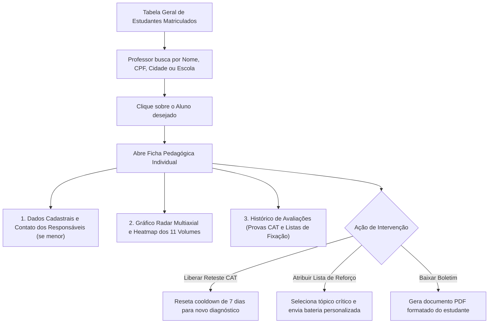

# 2. Gestão Individual de Alunos e Ficha Pedagógica

### 2.1 Acompanhamento e Intervenção Docente

```mermaid
flowchart TD
    A["Tabela Geral de Estudantes Matriculados"] --> B["Professor busca por Nome, CPF, Cidade ou Escola"]
    B --> C["Clique sobre o Aluno desejado"]
    
    C --> D["Abre Ficha Pedagógica Individual"]
    D --> E["1. Dados Cadastrais e Contato dos Responsáveis (se menor)"]
    D --> F["2. Gráfico Radar Multiaxial e Heatmap dos 11 Volumes"]
    D --> G["3. Histórico de Avaliações (Provas CAT e Listas de Fixação)"]
    
    D --> H{"Ação de Intervenção"}
    H -->|"Liberar Reteste CAT"| I["Reseta cooldown de 7 dias para novo diagnóstico"]
    H -->|"Atribuir Lista de Reforço"| J["Seleciona tópico crítico e envia bateria personalizada"]
    H -->|"Baixar Boletim"| K["Gera documento PDF formatado do estudante"]
```
