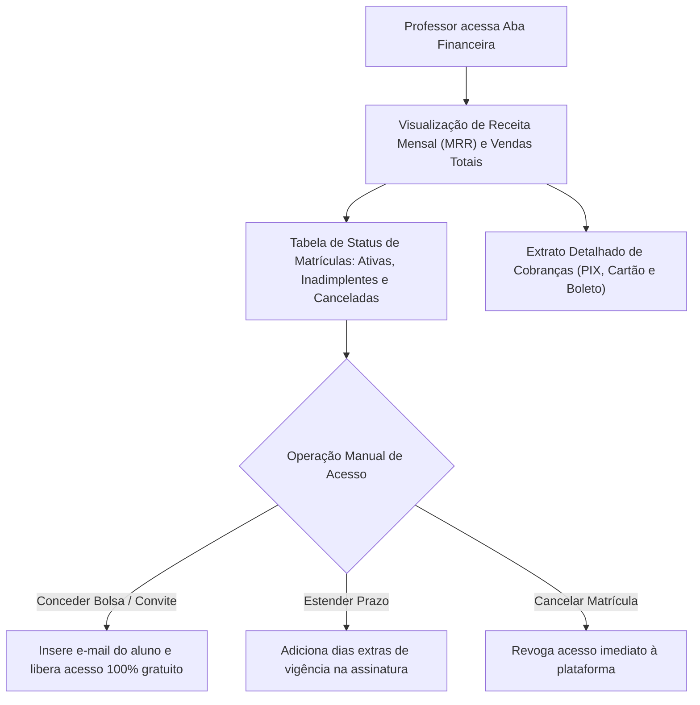

# 4. Gestão Financeira e Controle de Matrículas

### 4.1 Acompanhamento de Assinaturas e Acessos

```mermaid
flowchart TD
    A["Professor acessa Aba Financeira"] --> B["Visualização de Receita Mensal (MRR) e Vendas Totais"]
    
    B --> C["Tabela de Status de Matrículas: Ativas, Inadimplentes e Canceladas"]
    
    C --> D{"Operação Manual de Acesso"}
    D -->|"Conceder Bolsa / Convite"| E["Insere e-mail do aluno e libera acesso 100% gratuito"]
    D -->|"Estender Prazo"| F["Adiciona dias extras de vigência na assinatura"]
    D -->|"Cancelar Matrícula"| G["Revoga acesso imediato à plataforma"]
    
    B --> H["Extrato Detalhado de Cobranças (PIX, Cartão e Boleto)"]
```
